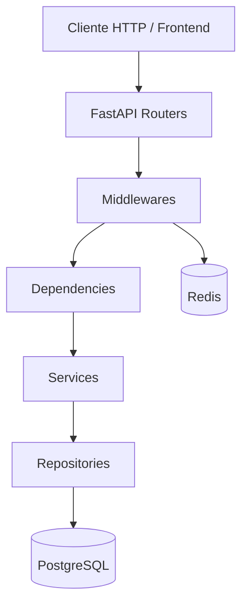
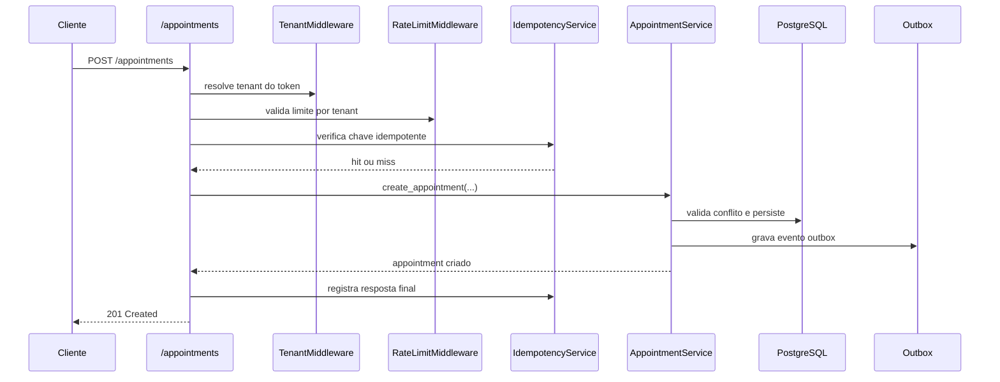
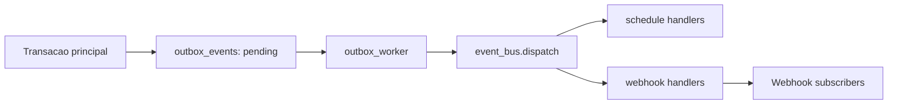

# Arquitetura Tecnica

## Objetivo arquitetural

O AIgenda foi estruturado para entregar agenda corporativa com:

- isolamento por tenant;
- consistencia de horario;
- seguranca (JWT + RBAC);
- resiliencia de escrita (idempotencia + outbox);
- observabilidade basica (auditoria).

## Camadas e fluxo principal

## Composicao da aplicacao

Ponto de entrada: `backend/main.py`.

Responsabilidades no bootstrap:

- instancia `FastAPI`;
- registra `TenantContextMiddleware` e `RateLimitMiddleware`;
- registra handlers globais de erro;
- registra handlers de eventos de schedule e notifications;
- inclui rotas atuais e legadas.

## Decisoes de arquitetura

## 1. Multi-tenancy via contexto

- middleware extrai tenant do JWT;
- tenant e armazenado em contexto de execucao;
- repositorios sensiveis exigem tenant no contexto;
- queries de entidades tenant-scoped sao protegidas por enforcement de sessao.

## 2. Defesa em profundidade para conflito de horario

- validacao aplicacional no `AppointmentService`;
- consulta de conflito com lock (`with_for_update`) no repositorio;
- indices e constraint de banco para reforco de integridade.

## 3. Escrita confiavel

- idempotencia por `Idempotency-Key` com hash canonico do corpo;
- outbox transacional para dissociar integracao externa da resposta HTTP;
- auditoria de alteracoes no ciclo de vida de compromissos.

## 4. Compatibilidade evolutiva

- rotas legadas (`/authentication/login`) coexistem com rotas atuais (`/auth/login`);
- schemas aceitam aliases de campos para transicao controlada de clientes.

## Fluxo de criacao de compromisso

## Fluxo de eventos

## Riscos tecnicos e oportunidades

- nomenclatura mista pt/en em partes do codigo e mensagens;
- aliases redundantes em alguns schemas;
- concentracao de modelos de auditoria/notificacao em modulo historico;
- necessidade de formalizar contratos de eventos para fases futuras.
