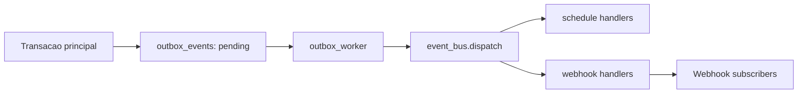

# Arquitetura Tecnica

## Objetivo arquitetural

O AIgenda foi estruturado para entregar agenda corporativa com:

- isolamento por tenant;
- consistencia de horario;
- seguranca (JWT + RBAC);
- resiliencia de escrita (idempotencia + outbox);
- observabilidade basica (auditoria).

# Architecture

O AIgenda segue uma arquitetura web em camadas, com frontend separado do backend e persistencia concentrada na camada de banco de dados.

No estado atual do repositorio, a arquitetura esta parcialmente implementada e parcialmente preparada como base para evolucao.

## Visao geral

O sistema pode ser entendido em tres blocos:

1. frontend para interface com o usuario;
2. backend para API e regras de negocio;
3. banco de dados para persistencia.

O frontend envia requisicoes HTTP ao backend.

O backend processa essas requisicoes e conversa com o banco para ler ou gravar dados.

## Backend e frontend em conjunto

O frontend atual usa Next.js para estruturar paginas, layouts e providers.

Quando o usuario executa uma acao, como login ou consulta de compromissos, a interface chama um service de frontend.

Esse service usa um cliente HTTP compartilhado para conversar com a API FastAPI.

No backend, a aplicacao principal registra routers de autenticacao, usuarios e compromissos.

Em termos de nomenclatura tecnica, isso aparece no codigo como `auth`, `users` e `appointments`.

Com isso, o sistema ja possui uma fronteira clara entre camada de interface e camada de negocio.

## Arquitetura em camadas no backend

A organizacao do backend aponta para esta separacao:

- routers para exposicao de endpoints;
- schemas para validacao de dados;
- services para regras de negocio;
- repositories para acesso a dados;
- models ORM para persistencia.

Mesmo quando alguns arquivos ainda estao enxutos, essa divisao deixa clara a intencao arquitetural e reduz acoplamento.

## Banco de dados e persistencia

O projeto usa SQLAlchemy e possui infraestrutura de banco em `backend/db/`.

Os modelos compartilham bases comuns com campos padrao de identificacao e auditoria temporal.

Um ponto importante da arquitetura e o uso de uma base orientada a tenant.

Isso sinaliza que o sistema foi pensado para isolar dados por empresa.

## Isolamento por empresa

O conceito de multi-tenancy aparece na modelagem por meio de `TenantModel` e do campo associado a empresa.

Arquiteturalmente, isso significa que o sistema nao trata todos os usuarios como pertencentes ao mesmo espaco de dados.

Cada empresa deve operar no proprio contexto.

## Estrategia de crescimento

O repositorio mostra uma fase de consolidacao.

Ha uma base atual mais enxuta no codigo principal e sinais de uma arquitetura mais ampla no historico e na organizacao anterior da documentacao.

Para quem vai evoluir o sistema, a direcao mais segura e continuar reforcando estas fronteiras:

- frontend focado em interface e consumo da API;
- backend focado em regras e persistencia;
- banco isolado em uma camada propria;
- testes acompanhando cada dominio.

## Beneficios dessa arquitetura

- facilita manutencao;
- melhora leitura por novos colaboradores;
- reduz mistura de responsabilidades;
- prepara o sistema para escalar por modulos;
- ajuda a introduzir novas funcionalidades sem reescrever a base inteira.
  API->>IDEM: verifica chave idempotente
  IDEM-->>API: hit ou miss
  API->>SVC: create_appointment(...)
  SVC->>DB: valida conflito e persiste
  SVC->>OUT: grava evento outbox
  SVC-->>API: appointment criado
  API->>IDEM: registra resposta final
  API-->>UI: 201 Created
```

## Fluxo de eventos



## Riscos tecnicos e oportunidades

- nomenclatura mista pt/en em partes do codigo e mensagens;
- aliases redundantes em alguns schemas;
- concentracao de modelos de auditoria/notificacao em modulo historico;
- necessidade de formalizar contratos de eventos para fases futuras.
