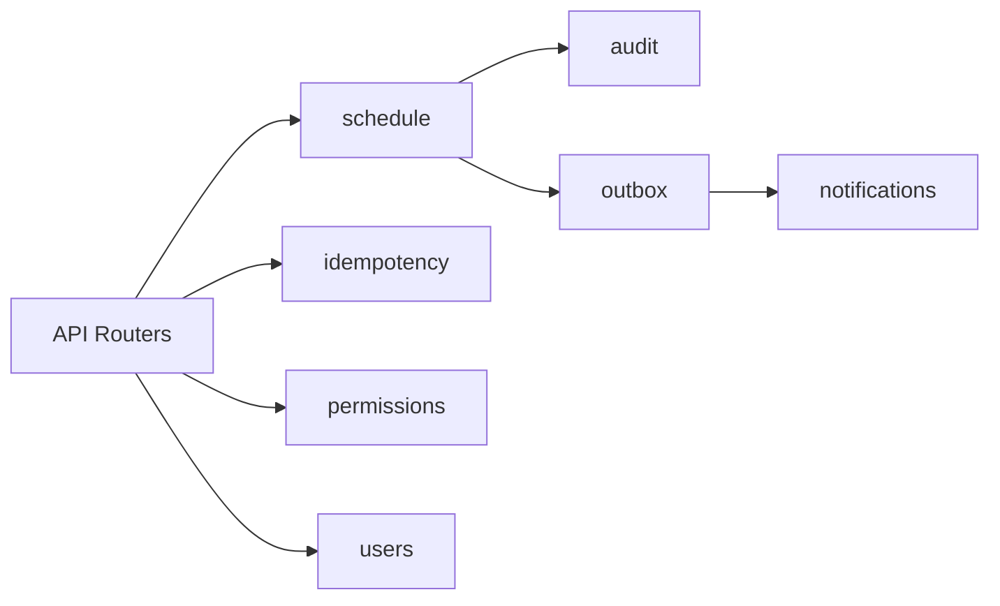

# Modulos do Backend

## Visao geral

A pasta `backend/app/modules/` separa o dominio por contexto de negocio.

## `schedule`

Responsavel pelo ciclo de vida de compromissos.

- modelos: `Appointment`, `AppointmentParticipant`.
- schemas: `AppointmentCreate`, `AppointmentUpdate`, `AppointmentResponse`.
- service: `AppointmentService`.
- repositorio: `AppointmentRepositoryAlias`.

Responsabilidades centrais:

- validacao de conflito de horario;
- controle de autoria em update/cancel;
- persistencia de participantes;
- emissao de auditoria e outbox.

## `users`

Define entidades base de identidade:

- `Company` (tenant/empresa).
- `User` (usuario da empresa).

## `permissions`

Implementa RBAC.

- modelos: `Role`, `Permission`, `UserRole`, `RolePermission`.
- service principal: `PermissionService.user_has_permission(...)`.

## `idempotency`

Garante que repeticao de request nao duplique escrita.

- service: `IdempotencyService`.
- repositorio: `IdempotencyRepository`.

Fluxo:

1. le header `Idempotency-Key`.
2. calcula hash canonico do body.
3. retorna resposta anterior se chave/hash forem iguais.
4. gera 409 se a chave ja existir com payload diferente.

## `outbox`

Implementa transactional outbox.

- modelo: `OutboxEvent`.
- service: `OutboxService` para gravar evento na mesma transacao do caso de uso.
- worker: `processar_eventos(...)` para dispatch assicrono.

## `audit`

Registra trilha de alteracoes de negocio.

- service: `AuditService`.
- modelo relacionado: `AuditLog` (em notifications/models por legado estrutural).

## `notifications`

Cuida de integracoes externas via webhook.

- modelo: `WebhookSubscription`.
- service: `WebhookService`.
- event handler: envio com assinatura `X-AIGENDA-SIGNATURE`.

## Relacao entre modulos

