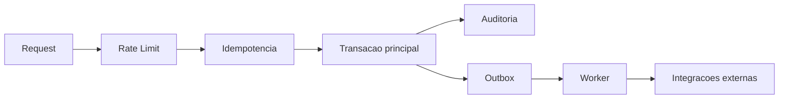

# Performance e Confiabilidade

## Objetivo

Manter previsibilidade de resposta e integridade de agenda mesmo sob concorrencia e retentativas.

## Recursos de performance no estado atual

## Banco de dados

- indices para consultas de agenda por tenant e janela de tempo;
- indices para relacionamento de participantes;
- estrutura de outbox e idempotencia com chaves/indices dedicados;
- constraints para reforco de consistencia em sobreposicao de horario.

## Runtime

- rate limit por tenant em Redis;
- consulta de conflito com lock em transacoes concorrentes (`with_for_update`);
- idempotencia para neutralizar repeticao de request;
- outbox para desacoplamento de integracoes externas.

## Confiabilidade operacional

## Cobertura de testes ligada a risco

Foco atual da suite:

- conflitos de horario;
- idempotencia;
- isolamento de tenant;
- permissao RBAC;
- rate limit;
- ciclo de outbox.

## Metricas recomendadas para evolucao

- latencia p50/p95/p99 por endpoint;
- taxa de 409 por conflito de horario;
- taxa de 429 por tenant;
- taxa de hit de idempotencia;
- backlog de outbox pendente;
- tempo medio de processamento de outbox;
- taxa de falha de webhook e numero de retentativas.

## Riscos tecnicos atuais

- padroes de nomenclatura mistos dificultam observabilidade consistente;
- possivel sobreposicao historica de migracoes requer vigilancia em novos ciclos;
- fases futuras exigirao observabilidade mais forte (tracing e metricas por caso de uso).
