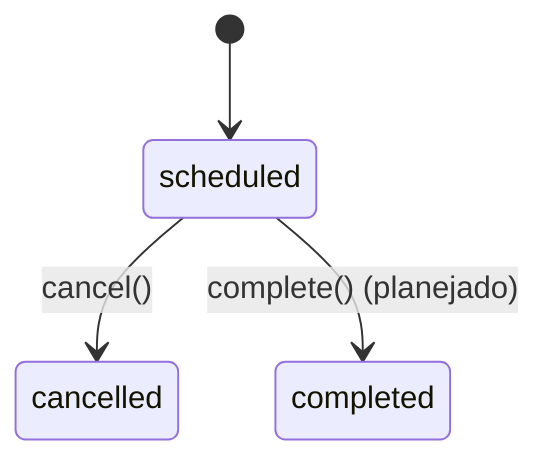
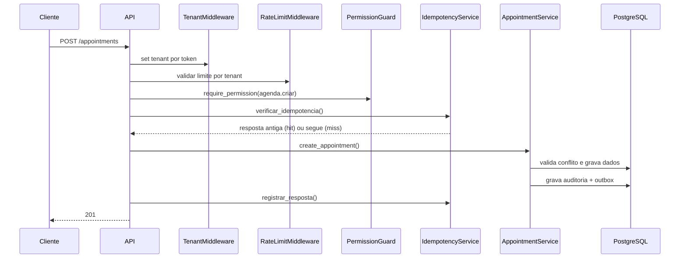

# Workflows Internos

## Maquina de estado de appointment

Regras observadas no codigo:

- update apenas em `scheduled`;
- cancel apenas em `scheduled`;
- update/cancel dependem de autoria do criador.

## Fluxo de login

1. cliente envia `company_identifier`, `email`, `senha`;
2. API busca `Company` por slug;
3. API busca `User` dentro da empresa;
4. API valida senha hash;
5. API gera JWT com `sub`, `company_id`, `company_slug`.

## Fluxo de criacao de compromisso

## Fluxo de update

1. carrega appointment no tenant atual;
2. valida autoria;
3. valida estado elegivel para update;
4. se horario mudar, revalida conflito;
5. persiste alteracoes + auditoria/outbox quando aplicavel.

## Fluxo de cancel

1. carrega appointment no tenant atual;
2. valida autoria e estado;
3. altera status para cancelado;
4. persiste alteracoes + auditoria/outbox.

## Fluxo de idempotencia

- sem `Idempotency-Key`: caminho normal;
- com chave nova: processa e armazena resposta;
- com chave + hash iguais: retorna resposta anterior;
- com chave repetida e hash diferente: erro 409.

## Fluxo de outbox e webhooks

1. service grava evento em `outbox_events` na mesma transacao de negocio;
2. worker busca eventos pendentes;
3. worker marca processing e executa `event_bus.dispatch`;
4. handlers executam logica de dominio/notificacao;
5. em sucesso, evento finaliza; em falha, incrementa tentativa.

## Triggers transversais

- tenant: middleware + contexto de execucao;
- rate limit: Redis por tenant e janela de minuto;
- conflito: service + repositorio com lock + estrutura de banco;
- auditoria: operacoes mutantes de agenda;
- integracao: gravacao outbox e processamento assincrono.
